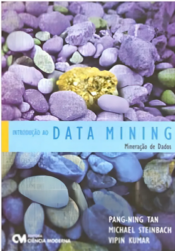
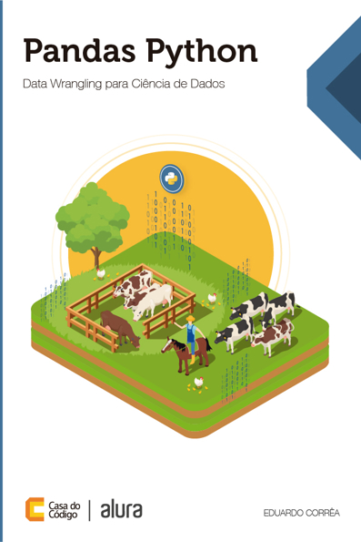
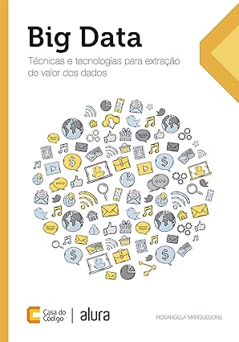
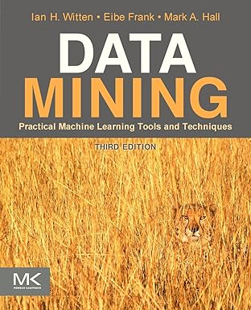
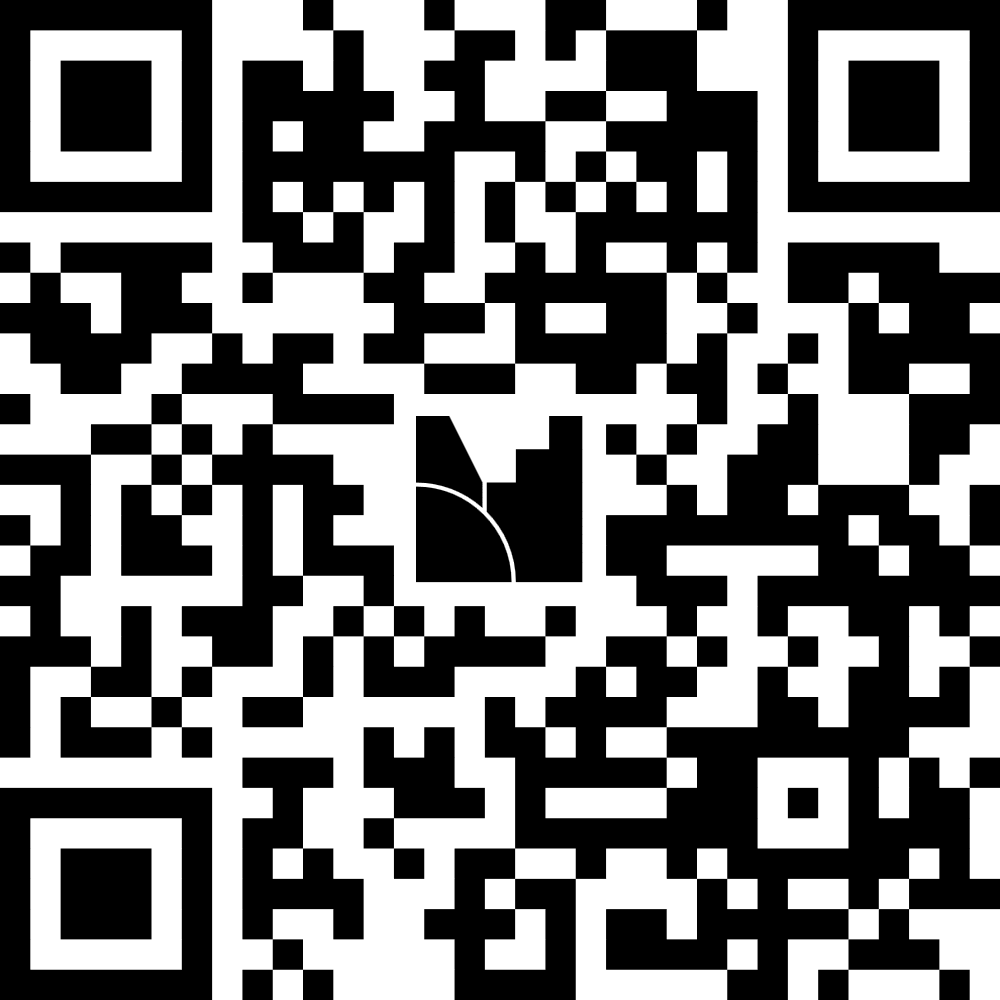

## Conteúdo Programático
::: {.nonincremental}
::: {.fontsize90}
- Introdução à Mineração de Dados. 
- Processo de Descoberta de Conhecimento em Bases de Dados. 
- Pré-processamento de Dados. 
- Tarefas e Técnicas de Mineração de Dados: 
    - Extração de Regras de Associação. 
    - Extração de Padrões de Sequência. 
    - Agrupamento. 
    - Classificação. 
    - Regressão. 
- Metodologias de avaliação da qualidade do conhecimento extraído. 
- Projetos de implementação abordando os conceitos apresentados na disciplina.
:::
:::

## Objetivos

Ao final do curso é esperado que o aluno:

- Conheça todas as **etapas** envolvidas no **processo de descoberta de conhecimento**.
- Tenha aprendido sobre as **tarefas de mineração de dados** e seus principais **algoritmos**.
- Seja capaz de **implementar** softwares/sistemas que realizem **análises de dados** a partir das **técnicas** apresentadas no curso.

## GAC127 em 2026/1

17 semanas de curso:

- Aulas teóricas (17 semanas): 09/03/2026 a 04/07/2026.
- Aulas práticas (17 semanas): 09/03/2026 a 04/07/2026.
- Avaliação adicional (1 semana): 06/07/2026.

## Avaliações

- **Prova 1:** 35 pontos.
- **Prova 2:** 35 pontos.
- **Trabalho Prático:** 30 pontos.

## Observações Importantes

- A aferição de frequência será realizada por **chamada oral** uma vez em cada dia de **aula presencial** em qualquer momento entre o início e o término da mesma. 
    - Para ter **presença na aula prática**, além de comparecer à aula, o **aluno deve fazer e entregar a(s) atividade(s) proposta(s) na aula**.  
    - Em eventual **aula não presencial (ANP), a presença** estará condicionada ao **preenchimento de questionário ou entrega de exercício** disponibilizado no Campus Virtual.

## Observações Importantes

- As **provas** deverão ser realizadas **individualmente**. 
- O **conteúdo** avaliado em **cada prova** é todo aquele dado até a **semana anterior** à da realização da prova. 
- **Revisões** de provas serão feitas no máximo até **15 dias** letivos após a divulgação das notas.
- **Qualquer entrega de material** (exercícios, questionários etc.) deve ser feita única e **exclusivamente** por meio do **Campus Virtual**.

## Observações Importantes

- **Exercícios, questionários e provas** entregues também **serão avaliados quanto a cópias e fraudes**. 
    - Os alunos podem **discutir a resolução dos exercícios** com os colegas, mas essa discussão deve ser limitada ao campo das ideias, **sem o compartilhamento de implementações**.
    - **Cada aluno** deverá **entregar a sua própria versão da resolução** dos mesmos. 
    - As **cópias/fraudes** resultarão em **nota zero** e abertura de **processo disciplinar**.  
- **Segunda chamada** de atividades avaliativas: **apenas** para alunos **com pedidos** de substituição de atividades acadêmicas **aprovados pela PRG**.

## Plágio

O que pode ser enquadrado como plágio?

- Produzir individualmente uma implementação original, mas revelar sua implementação a terceiros.
- Atividades individuais feitas em grupo.
- Atividades de alunos diferentes [com partes]{.underline} muito semelhantes.
- Recrutamento de outras pessoas para realizar as atividades no lugar do aluno.
- Entregar soluções obtidas de terceiros (inclusive aquelas disponibilizadas na internet).

## Recuperação

Para os alunos que **não alcançarem 60 pontos** no final do semestre (NF), será dada uma **prova adicional** avaliando **todo o conteúdo da disciplina**. 

- Para se obter a **nota final recuperada** (NFR) será calculada a **média aritmética** entre a nota da prova adicional e a nota final do semestre antes da prova adicional (NF).

## Bibliografia
::: {.nonincremental}
::::{.columns style='display: flex !important; align-items: center;'}

::: {.column width="25%"}
{fig-alt="Livro_Tan" fig-align="center" width=65%}
:::

::: {.column width="75%"}

- TAN, Pang-Ning; STEINBACH, Michael; KUMAR, Vipin. **Introdução ao Data Mining: Mineração de Dados**. Rio de Janeiro, RJ: Ciencia Moderna, 2009.

:::

::::

::::{.columns style='display: flex !important; align-items: center;'}

::: {.column width="25%"}
{fig-alt="Livro_Correa" fig-align="center" width=65%}
:::

::: {.column width="75%"}

- CORRÊA, Eduardo. **Pandas Python: Data Wrangling para Ciência de Dados**. São Paulo: Casa do Código, 2020. E-book.

:::

::::
:::

## Bibliografia
::: {.nonincremental}
::::{.columns style='display: flex !important; align-items: center;'}

::: {.column width="25%"}
{fig-alt="Livro_Marquesone" fig-align="center" width=65%}
:::

::: {.column width="75%"}

- MARQUESONE, Rosangela. **Big Data: Técnicas e Tecnologias para Extração de Valor dos Dados**. São Paulo: Casa do Código, 2016. E-book.

:::

::::

::::{.columns style='display: flex !important; align-items: center;'}

::: {.column width="25%"}
{fig-alt="Livro_Witten" fig-align="center" width=65%}
:::

::: {.column width="75%"}

- WITTEN, I. H; FRANK, Eibe; HALL, Mark A. **Data mining: Practical Machine Learning Tools and Tecniques**. 3rd ed. Morgan Kaufmann, 2011.

:::

::::
:::

## Enquete

{fig-alt="Enquete" fig-align="center" width=50%}

##

{fig-alt="Perguntas" fig-align="center" width=35%}