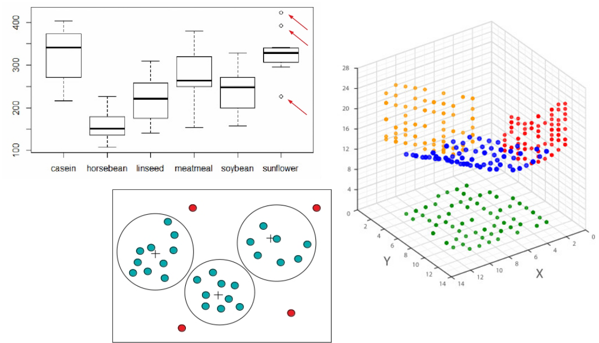

 ---
title: "Pré-processamento de Dados"
subtitle: "  "
title-slide-attributes:
    data-background-size: contain
    data-background-position-x: center
    data-background-position-y: center
---

## **Conteúdo da Aula**  

::::{.columns style='display: flex !important; height: 70%; align-items: center;'}

::: {.column width="20%"}
{fig-alt="Professor1-1" fig-align="center"}
:::

::: {.column width="80%"}
::: {.nonincremental}
::: {style="font-size: 120%;"}
- Limpeza de Dados
- Integração de Dados
- Transformação de Dados
- Redução de Dados
- Balanceamento de Dados
:::
:::
:::

:::: 

##
::::{.columns style='height: 100%; display: flex !important; align-items: center;'}
::: {.column width="40%"}
{fig-alt="Data Mining" fig-align="center" width=100%}
:::

::: {.column width="60%"}
::: {style="text-align: center; font-size: 1.3em;"}
**O que é Mineração de Dados?**
:::

:::{style="text-align: justify;"}
[É o **processo automático** de **descoberta** de novas **informações** e **conhecimento**, úteis a uma aplicação, no formato de regras e padrões, "escondidas" em [grandes volumes de dados]{.alert}.]{.fragment}
:::
:::
::::

# **Dados** {background-color="#0efb45ce" style="text-align: center;"}

## **Formatos de Dados**
:::{style='font-size: 0.9em;'}
Até pouco tempo atrás, técnicas de mineração de dados eram aplicadas apenas a conjunto de dados em um [formato estruturado]{.alert}.

- Dados representados por meio de uma matriz bidimensional $n \times m$, onde $n$ é o número de linhas e $m$ é o número de colunas.
  - Cada **linha** representa um objeto do conjunto de dados: registro, [instância]{.alert}, exemplo etc.
  - Cada **coluna** representa uma característica do objeto no conjunto de dados: variável, [atributo]{.alert}, campo etc.
:::

::::{.columns style='display: flex !important; font-size: 0.8em;' .fragment}
::: {.column width="60%"}

::: {.table-bordered style='display: flex !important; font-size: 0.9em; '}
| Nome     | Peso     | Pressão  | Temp     |
|:---------|:--------:|:--------:|:--------:|
| Pedro    | 78       | 125      | 39       |
| Tiago    | 54       | 120      | 37       |
| Caio     | 87       | 148      | 38       |
:::
:::

::: {.column width="40%"}
Conjunto de dados [estruturado]{.alert} com **3 instâncias** e **4 atributos** (Nome, Peso, Pressão e Temp).
:::
::::

## **Formatos de Dados**
Apesar de grande parte das técnicas de mineração de dados funcionarem principalmente em conjuntos de dados estruturados, a maioria dos conjuntos de dados reais produzidos atualmente são [não estruturados]{.alert}.

::::{.columns style='height: 60%; display: flex !important; align-items: center;'}
::: {.column width="60%"}
{fig-alt="Data Mining" fig-align="center" width=80%}

:::
::: {.column width="40%"}
Enquanto dados estruturados são mais fáceis de serem processados, os não estruturados são geralmente mais fáceis de serem analisados por humanos.
:::
::::

## **Formatos de Dados**
:::{style='height: 70%; align-items: center; display: flex !important;'}
- Os formatos de dados não se resumem apenas a [estruturados]{.alert} e [não estruturados]{.alert}.
- Existe um **outro formato** que fica entre esses dois: o [semi-estruturado]{.alert}.
  - Apresentam **alguma estrutura** em **parte** dos dados.
  - Exemplos: e-mails, arquivos XML.
- Vale observar que grande parte das técnicas utilizadas para [análise de dados]{.alert} funcionam apenas para [dados estruturados]{.alert}.
:::

## **Dados Não Rotulados *versus* Dados Rotulados**
::::{.columns style='height: 40%; align-items: center; display: flex !important; font-size: 0.8em;' .fragment}
::: {.column width="50%"}

::: {.table-bordered style='display: flex !important; font-size: 0.9em; '}
| Nome     | Peso     | Pressão  | Temp     |
|:---------|:--------:|:--------:|:--------:|
| Pedro    | 78       | 125      | 39       |
| Tiago    | 54       | 120      | 37       |
| Caio     | 87       | 148      | 38       |
:::
:::

::: {.column width="50%" .nonincremental}
- Conjunto de dados **estruturado** [não rotulado]{.alert}. 
- Cada um dos **4 atributos** é denominado [atributo descritivo]{.alert}.
- Dados usados por [tarefas descritivas]{.alert}.
:::
::::

::::{.columns style='height: 45%; align-items: center; display: flex !important; font-size: 0.8em;' .fragment}
::: {.column width="50%"}

::: {.table-bordered style='display: flex !important; font-size: 0.9em; '}
| Nome     | Peso     | Pressão  | Temp     |  Diagnóstico  |
|:---------|:--------:|:--------:|:--------:|:-------------:|
| Pedro    | 78       | 125      | 39       |   Doente      |
| Tiago    | 54       | 120      | 37       |  Saudável     |
| Caio     | 87       | 148      | 38       |   Doente      |
:::
:::

::: {.column width="50%" .nonincremental}
- Conjunto de dados **estruturado** [rotulado]{.alert}. 
- Os **4 primeiros atributos** são denominados [atributos preditivos]{.alert}.
- O **último atributo** (Diagnóstico) é conhecido como rótulo, atributo alvo ou [atributo classe]{.alert}.
- Dados usados por [tarefas preditivas]{.alert}.
:::
::::

## **Tipos de Dados**
:::{style='font-size: 0.7em;'}
É importante conhecermos os **tipos de dados** porque eles [determinam]{.alert} quais [ferramentas e técnicas]{.alert} podem ser usadas para [analisar os dados]{.alert}.
:::

::: {.table-bordered .table-header-center style='display: flex !important; font-size: 0.55em; '}
| Tipos de atributo   | Principais características | Subtipos   | Exemplos |
|:------------------:|----------------------------|:----------:|----------|
| **Numéricos  (quantitativos)** | Representam quantidades numéricas;  permitem operações matemáticas (soma,  média, desvio padrão etc.); usados em  cálculos estatísticos e métricas de distância | **Contínuos** | Altura (1,72 m), temperatura (36,5 °C), peso (70,3 kg) |
|                  |                            | **Discretos** | Número de filhos (2), quantidade de compras (5), número de acessos (10) |
| **Categóricos  (qualitativos)** | Representam categorias ou rótulos; não  permitem operações aritméticas; análise  baseada em igualdade/diferença  e >, < (para ordinais) | **Nominais** | Cor dos olhos (azul, verde), sexo (M, F), país (Brasil, Chile) |
|                  |                            | **Ordinais** | Nível de satisfação (baixo, médio, alto), escolaridade (fundamental, médio, superior) |
:::

# **Etapas de um Projeto de Ciência de Dados** {background-color="#0efb45ce" style="text-align: center;"}

## **Etapas de um Projeto**
:::{style='font-size: 0.8em;'}
A [execução]{.alert} de um [projeto]{.alert} de ciência de dados envolve as [diversas etapas]{.alert}:

- **Entendimento do domínio da aplicação**: [Compreender o problema]{.alert} a ser resolvido, identificando os [objetivos do projeto]{.alert} do ponto de vista do [cliente]{.alert}.
- **Coleta de dados**: [Reunir os dados]{.alert} necessários para a análise.
- **Pré-processamento de dados**: [Detectar]{.alert} e [corrigir problemas nos dados]{.alert} visando melhorar a qualidade dos mesmos. Inclui tarefas como identificação e remoção de [ruídos]{.alert}, tratamento de [valores ausentes]{.alert} e de [inconsistências]{.alert}.
- **Transformação de dados**: [Transformar os dados]{.alert} para um [formato adequado]{.alert} para a análise dos mesmos. Inclui tarefas como [normalização]{.alert} e [discretização]{.alert} de dados.
- **Modelagem**: [Escolher e aplicar]{.alert} os [algoritmos]{.alert} para [construir modelos]{.alert} preditivos ou descritivos, dependendo do objetivo do projeto.
- **Avaliação**: [Avaliar o desempenho]{.alert} dos modelos utilizando métricas apropriadas e [validar os resultados]{.alert}.
- **Implantação**: [Implantar os modelos]{.alert} em um [ambiente de produção]{.alert} para que possam ser utilizados pelo cliente.
:::

## **Processo de Descoberta de Conhecimento em Bases de Dados**
{fig-alt="Processo KDD" fig-align="center" width=100%}

# **Pré-processamento de Dados  [Limpeza de Dados]{.fontsize80}** {background-color="#0efb45ce" style="text-align: center;"}

## **Qualidade dos Dados**

- A [mineração de dados]{.alert} é muitas vezes [aplicada a dados]{.alert} que foram [coletados e armazenados]{.alert} por [outros propósitos]{.alert} ou para [aplicações futuras]{.alert} não especificadas. 
  - Isso faz com que esses [dados]{.alert} possam [não ter a qualidade]{.alert} desejada para a mineração de dados.
- Esses dados podem conter [inconsistências]{.alert}, [ruídos]{.alert} e [valores ausentes]{.alert}, o que pode levar a [resultados]{.alert} de mineração de dados [imprecisos ou enganosos]{.alert}.
- Portanto, dois caminhos são possíveis para lidar com essa questão:
  - [Realizar pré-processamento]{.alert} para detectar e corrigir problemas de qualidade dos dados.
  - Usar [algoritmos]{.alert} que tenham a capacidade de [lidar]{.alert} com [dados]{.alert} de [baixa qualidade]{.alert}. 

##  **Qualidade dos Dados**
:::{style='font-size: 0.9em;'}
Dentre os [problemas comuns]{.alert} de qualidade dos dados, podemos destacar:

- [Inconsistências]{.alert}: Valores inconsistentes de atributos ou informações conflitantes. 
  - **Exemplo:** um registro de uma pessoa com 3 anos que tem formação em curso de nível superior.
- [Valores ausentes]{.alert}: Ausência de valores de atributos. 
  - **Exemplo:** um registro de paciente que não tem o peso registrado.
- [Ruídos e *outliers*]{.alert}: Dados que contêm erros e valores atípicos que podem distorcer a análise. 
  - **Exemplo de ruído:** um registro de temperatura corporal que indica um valor de 50 °C (biologicamente impossível).
  - **Exemplo de *outlier*:** um registro de peso de uma pessoa que indica um valor de 180 kg (biologicamente improvável).
:::

## **Inconsistências**
::: {style='height: 70%; display: flex; flex-direction: column; justify-content: center;'}

[Como surgem]{.alert} os dados inconsistentes?

- [Erro]{.alert} humano no momento da [coleta]{.alert} de dados.
- [Erros]{.alert} gerados pelos [equipamentos de coleta]{.alert} de dados.
- [Erros]{.alert} provenientes da [integração]{.alert} de diferentes [bases]{.alert} de dados:
  - Mesmo atributo contendo diferentes codificações.
  - Duplicação de instâncias.
:::

## **Inconsistências**
:::{style='font-size: 0.9em;'}
[Como encontrar]{.alert} as inconsistências?

- Usar todo [conhecimento obtido]{.alert} a partir de uma [análise prévia]{.alert} dos dados:
  - Quais [tipos de dado]{.alert} e [domínio]{.alert} de cada atributo da base de dados?
  - Quais são os [valores aceitáveis]{.alert} para cada atributo?
  - Todos os [valores do atributo]{.alert} estão contidos no conjunto de [valores aceitáveis]{.alert}?
  - A partir de [descritores estatísticos]{.alert} (medidas de tendência central e de dispersão) é possível [identificar valores atípicos]{.alert}?
- Verificar [inconsistências]{.alert} na [representação dos dados]{.alert} (p.ex., datas como 08/03/2026 e 2026/03/08).
- [Avaliar]{.alert} se existem [regras]{.alert} para os atributos (p.ex.: o atributo pode conter valores nulos?).
:::

## **Inconsistências**
::: {style='height: 70%; display: flex; flex-direction: column; justify-content: center;'}
[Como corrigir]{.alert} as inconsistências?

- [Escrever]{.alert} seu [próprio código]{.alert} para detectar e corrigir inconsistências.
- [Usar técnicas]{.alert} de [detecção]{.alert} e [correção]{.alert} de inconsistências, como:
  - [Regras de consistência]{.alert}: definir regras para verificar a consistência dos dados e corrigir os dados que violam essas regras.
  - [Algoritmos de detecção de duplicatas]{.alert}: identificar e remover instâncias duplicadas.
:::

## **Valores Ausentes**
::: {.nonincremental}
[Valores de atributos ]{.alert}(dados) nem sempre estão disponíveis.

  - **Exemplo:** vários registros de uma base de dados de vendas não possuem valores para o atributo [salário do consumidor]{.alert}.
:::

:::{.fragment }
A [ausência]{.alert} de dados pode ser [resultado de]{.alert}:

  - Mau funcionamento de equipamento.
  - Inconsistência com outros dados armazenados e, portanto, apagado.
  - Dado não inserido devido à falta de entendimento.
  - Dado foi considerado sem importância no momento da coleta.
:::

## **Valores Ausentes**
:::{style='font-size: 0.95em;'}
[Como lidar]{.alert} com os valores ausentes de atributos?

::: {.incremental}

- [Ignorar o registro]{.alert} (instância): usualmente utilizado quando o atributo classe possui valor desconhecido ou quando a instância contém muitos valores de atributos desconhecidos.

- [Preencher]{.alert} os valores ausentes [manualmente]{.alert}: tedioso + inviável?

- [Usar]{.alert} uma [constante global]{.alert} para preencher os valores ausentes: "desconhecido".

- [Usar]{.alert} uma [medida de tendência central]{.alert} do atributo (p. ex. média, moda) para preencher os valores ausentes.

- [Usar]{.alert} uma [medida de tendência central]{.alert} das [instâncias]{.alert} pertencentes à [mesma classe da instância]{.alert} que possui o valor ausente.

- [Utilizar]{.alert} o [valor mais provável]{.alert} para preencher o valor ausente: regressão, inferência Bayesiana, árvores de decisão etc.

:::
:::

## **Valores Ausentes**
::: {style='height: 70%; display: flex; flex-direction: column; justify-content: center;'}

::: {.callout-tip .nonincremental}
### Observação
[Alguns algoritmos]{.alert} de mineração de dados possuem [mecanismos internos]{.alert} capazes de [lidar com valores ausentes]{.alert} durante o processo de [construção do modelo]{.alert}, sem a necessidade de pré-processamento para preenchimento dos valores ausentes.

- **Exemplos:** comitês de árvores de decisão, Naive Bayes e k-vizinhos mais próximos.
:::
:::

## **Ruídos**
Ruídos são resultantes de [desvios aleatórios]{.alert} ou [erros sistemáticos]{.alert} na coleta ou registro dos dados.

- [Desvios aleatórios]{.alert}: erros que ocorrem de [forma imprevisível]{.alert} e [sem um padrão]{.alert} específico. 
  - **Exemplo:** um sensor de temperatura que ocasionalmente registra um valor incorreto devido a uma falha momentânea.
- [Erros sistemáticos]{.alert}: erros que ocorrem de [forma consistente]{.alert}, geralmente devido a um problema no processo de coleta ou registro dos dados. 
  - **Exemplo:** um sensor de temperatura que está mal calibrado e registra consistentemente valores mais altos do que a temperatura real.

## **Ruídos**
[Quais as consequências]{.alert} dos ruídos no processo de mineração de dados?

- Aumento do [tempo de processamento]{.alert} para geração dos modelos.
- Aumento da [complexidade dos modelos]{.alert} gerados, o que pode reduzir o desempenho dos modelos.

::: {.callout-tip .fragment}
### Observação
Geralmente é **difícil ter certeza** de que um valor **é um ruído**. A menos que o valor seja inconsistente, tem-se apenas uma **suspeita** de que o valor seja um ruído.
:::
[Uma vez identificados os ruídos, eles podem ser tratados de [maneira semelhante ao tratamento de valores ausentes]{.alert}]{.fragment}.

## ***Outliers***
::: {style='height: 70%; display: flex; flex-direction: column; justify-content: center;'}
*Outliers* são valores atípicos que se diferenciam significativamente dos demais dados.

- A presença de *outliers* [não necessariamente]{.alert} é um [problema]{.alert} com a qualidade dos dados, podendo ser apenas uma [variação natural]{.alert} nos dados.
- Portanto, é importante [identificar]{.alert} e [analisar]{.alert} os *outliers* para determinar se eles são [resultado de erros]{.alert} ou se representam [variações legítimas]{.alert} nos dados.
:::

## **Identificação de Ruídos e *Outliers***
:::{style='font-size: 0.8em;'}
A identificação de valores atípicos pode ser feita por meio de [descritores estatísticos]{.alert} (p.ex., valores que estão a mais de 3 desvios padrão da média), por meio de [visualizações]{.alert} (p.ex., boxplots) ou com [uso de algoritmos]{.alert} de agrupamento.
:::
{fig-alt="Identificacao Outliers" fig-align="center" width=80%}

# **Pré-processamento de Dados  [Integração de Dados]{.fontsize80}** {background-color="#0efb45ce" style="text-align: center;"}

## **Integração de Dados**
::: {style='height: 70%; display: flex; flex-direction: column; justify-content: center;'}
::: {.incremental}
[Finalidade da integração de dados:]{.alert} combinar dados de [múltiplas fontes]{.alert} em uma [única fonte]{.alert} de forma coerente. As fontes podem ser diversas bases de dados, cubos de dados ou arquivos de texto.

- Integração de dados é muito comum em processos de mineração de dados.
- Uma integração cuidadosa pode evitar redundâncias e inconsistências nos dados.
:::
:::

## **Integração de Dados**
:::{style='font-size: 0.85em;'}
Questões a serem consideradas durante a integração:

- [Problema da identificação de entidades:]{.alert} identificação das mesmas entidades do mundo real a partir de múltiplas fontes de dados.

  - **Exemplo:** Como um analista saberá se `customer_id` em uma base de dados e `cust_number` em outra base de dados correspondem ao mesmo atributo? [**R.:** Uso de metadados.]{.fragment}
    
  
- [Redundância em termos de atributos:]{.alert} dados redundantes ocorrem com frequência quando integramos dados de múltiplas fontes.
  - O [mesmo atributo]{.alert} pode ter [nomes diferentes]{.alert} em [bases]{.alert} de dados [distintas]{.alert}.
  - Um [atributo]{.alert} pode ter sido [derivado]{.alert} de outro atributo em outra tabela.

- [Como detectar]{.alert} redundâncias entre atributos? [**R.:** Análise de correlação (Teste $\chi^2$, Coeficiente de Correlação de Pearson etc.).]{.fragment}

- [Redundância em termos de registros:]{.alert} duplicação de instâncias.
:::

# **Transformação de Dados** {background-color="#0efb45ce" style="text-align: center;"}

## **Transformação de Dados**
:::{.nonincremental}
[Objetivo:]{.alert} 

- Colocar os dados de forma apropriada para a etapa de mineração.
:::

[ Benefícios da transformação de dados:]{.alert .fragment}

- Tornar a etapa de mineração de dados mais eficiente.
- Obter padrões mais fáceis de serem entendidos.

[Como ela ocorre?]{.alert .fragment}

- Por meio da [transformação]{.alert} dos [valores atuais]{.alert} dos atributos em [outro conjunto de valores]{.alert} que sejam mais adequados para a etapa de mineração de dados. 

## **Transformação de Dados**
:::{style='font-size: 0.9em;'}

A transformação de dados pode envolver:

- [Anonimização de dados]{.alert}: ocultação ou remoção de dados sensíveis.  
- [Geração de hierarquia de conceitos]{.alert}: substituição de dados primitivos por conceitos de ordem superior utilizando-se uma hierarquia de conceitos. 
  - **Exemplo:** atributo Rua $\rightarrow$ atributo Cidade ou País. 
- [Transformação de dados numéricos]{.alert}: alteração do valor numérico de um atributo quantitativo para outro valor numérico. 
  - **Exemplo:** normalização de dados.
- [Conversão de dados entre tipos diferentes:]{.alert} alteração do tipo dos valores de um atributo. 
  - **Exemplo:** conversão de um atributo numérico para um atributo categórico por meio da discretização.
:::  

## **Anonimização de Dados**
:::{style='font-size: 0.85em;'}
É o processo de [ocultar]{.alert} ou [remover dados sensíveis]{.alert} para [proteger]{.alert} a [privacidade]{.alert} dos indivíduos ou organizações envolvidos.

- O processo de anonimização deve englobar [informações]{.alert} que possam [identificar]{.alert} alguém [direta]{.alert} ou [indiretamente]{.alert}.
  - **Exemplos de dados sensíveis:** nome, e-mail, endereço, foto, número de telefone, CPF, RG, número de cartão de crédito etc.

[**Técnicas de Anonimização**]{.fragment}

- [Supressão]{.alert}: remoção completa de dados sensíveis.
- [Generalização]{.alert}: substituição de dados sensíveis por valores mais generais.<!-- **Exemplo:** substituição do número telefônico pelo código da região. (Isso impede de recuperar o valor original)-->
- [Perturbação]{.alert}: adição de ruído aos dados sensíveis para torná-los menos identificáveis.
- [Criptografia]{.alert}: transformação de dados sensíveis em um formato ilegível sem a chave de descriptografia.
:::

## **Anonimização de Dados**
::: {.callout-note}
## Observação
Em uma base de dados, [cada atributo]{.alert} pode ser [anonimizado]{.alert} de uma [maneira diferente]{.alert} e a [estratégia]{.alert} de anonimização deve ser [escolhida]{.alert} com base no [tipo de dado]{.alert} existente.
:::

:::{style='font-size: 0.9em;'}
[**Atributos Qualitativos:**]{.fragment}

- [Nominais:]{.alert} basta preservar a mesma quantidade de valores, utilizando valores que não possibilitem a identificação dos objetos. 
  - **Exemplo:** substituição do nome dos clientes por códigos alfanuméricos.
- [Ordinais:]{.alert} deve-se preservar a ordem relativa dos valores, novamente utilizando valores que não possibilitem a identificação dos objetos. 
  - **Exemplo:** substituição de uma escala de satisfação (insatisfeito, neutro, satisfeito, muito insatisfeito) por uma escala (1,2,3,4).
:::

## **Anonimização de Dados**
::: {.callout-note}
## Observação
Em uma base de dados, [cada atributo]{.alert} pode ser [anonimizado]{.alert} de uma [maneira diferente]{.alert} e a [estratégia]{.alert} de anonimização deve ser [escolhida]{.alert} com base no [tipo de dado]{.alert} existente.
:::

:::{style='font-size: 0.9em;'}
[**Atributos Quantitativos:**]{.fragment}

- [Com perda de informação:]{.alert} pode-se usar a generalização, substituindo os valores por intervalos. 
  - **Exemplo:** substituição da idade de clientes por faixas etárias (0-18, 19-35, 36-60, 60+).
- [Sem perda de informação:]{.alert} pode-se usar a perturbação, adicionando um valor constante aos valores numéricos. 
  - **Exemplo:** adição de um valor constante à idade dos clientes.
:::

## **Transformação de Dados Numéricos**
::: {style='height: 70%; display: flex; flex-direction: column; justify-content: center;'}
O [objetivo]{.alert} dessa transformação é [alterar]{.alert} a [variação]{.alert} ou [espalhamento]{.alert} dos valores numéricos originais.

:::{.fragment}
As duas [técnicas]{.alert} mais [comuns]{.alert} para [transformação]{.alert} de dados numéricos são:

- Aplicação de [funções matemáticas]{.alert} simples.
- [Normalização]{.alert}.
:::
:::

## **Transformação de Dados Numéricos**
### **Funções Matemáticas Simples**
:::{style='font-size: 0.95em;'}
Uma [função matemática]{.alert} simples é [aplicada]{.alert} aos [valores]{.alert} numéricos originais de um [atributo preditivo]{.alert}.

- Essa [transformação]{.alert} altera a [distribuição de valores]{.alert} de um atributo para atender alguma necessidade da aplicação.

:::{.fragment}
[Funções]{.alert} matemáticas comumente [utilizadas]{.alert}:

- [Função logarítmica:]{.alert} usada para reduzir a escala de valores muito grandes.
  - Para distribuições com cauda longa, ajuda a reduzir a influência de valores extremos, tornando a distribuição mais simétrica.
  - **Exemplos:** renda, faturamento, contagem de eventos (cliques).
:::
:::

## **Transformação de Dados Numéricos**
### **Funções Matemáticas Simples**
:::{style='font-size: 0.95em;'}
[Funções]{.alert} matemáticas comumente [utilizadas:]{.alert}

- [Função raiz quadrada:]{.alert} usada para reduzir a escala de valores muito grandes, mas de forma menos agressiva do que a função logarítmica.
  - **Exemplo:** Considere os seguintes valores de um atributo: 1, 10 e 100. A aplicação da função logarítmica (base 10) resultaria em 0, 1 e 2, respectivamente, enquanto a aplicação da função raiz quadrada resultaria em 1; 3,16 e 10, respectivamente.
- [Inverso:]{.alert} usada para transformar valores pequenos em valores grandes e vice-versa (para valores $\neq$ 0).
- [Módulo:]{.alert} usada para transformar valores negativos em valores positivos.
:::

## **Transformação de Dados Numéricos**
### **Normalização de Dados**
::: {style='height: 70%; display: flex; flex-direction: column; justify-content: center;'}
Em alguns conjuntos de dados, os atributos numéricos podem ter [escalas muito diferentes]{.alert}, o que pode afetar o desempenho de alguns algoritmos de mineração de dados.

- **Exemplo:** um conjunto de dados de clientes pode conter o atributo de idade (com valores entre 0 e 100) e o atributo de renda (com valores entre 1.000 e 30.000).
:::  

## **Transformação de Dados Numéricos**
### **Normalização de Dados**
:::{style='font-size: 0.95em;'}
Por que [atributos]{.alert} com escalas muito [diferentes]{.alert} podem [afetar]{.alert} o [desempenho]{.alert} de alguns [algoritmos]{.alert} de mineração de dados?

- Algoritmos baseados em distância podem ser influenciados por atributos com escalas maiores, fazendo com que esses atributos tenham maior influência no modelo do que atributos com escalas menores.
  - k-NN e agrupamento hierárquico são exemplos de algoritmos baseados em distância.
- Algoritmos de otimização (p.ex., gradiente descendente) podem ter dificuldades para convergir quando os atributos têm escalas muito diferentes. 
  - Redes neurais utilizam gradiente descendente para otimizar os pesos da rede.
:::

## **Transformação de Dados Numéricos**
### **Normalização de Dados**
Dentre as diferentes técnicas de normalização, podemos destacar:

- Normalização por escala: transforma os valores de um atributo para um intervalo específico pré-definido, por exemplo [0, 1] ou [-1, 1].
- Normalização por padronização ou variação: transforma os valores de um atributo em um conjunto de valores que terá média 0 e desvio padrão 1.

## **Transformação de Dados Numéricos**
### **Normalização de Dados por Escala**
A normalização por escala é realizada por meio da seguinte fórmula:

:::{style='font-size: 0.9em;'}
$$x_i' = \frac{x_i - \text{min}(X)}{\text{max}(X) - \text{min}(X)} * (\text{max}_{novo}(X) - \text{min}_{novo}(X)) + \text{min}_{novo}(X),$$
:::
:::{.nonincremental}
onde:

- $x_i$ é o valor original do atributo,
- $\text{min}(X)$ e $\text{max}(X)$ são, respectivamente, o menor e o maior valor do atributo $X$,
- $\text{min}_{novo}(X)$ e $\text{max}_{novo}(X)$ são, respectivamente, o menor e o maior valor do atributo $X$ após a normalização.
:::

## **Transformação de Dados Numéricos**
### **Normalização de Dados por Escala**
Quais são as desvantagens da normalização por escala?

- É sensível a *outliers*, pois a presença de um valor extremo pode distorcer a escala dos dados.
  - A maioria dos valores ficará concentrada em uma pequena faixa do intervalo normalizado.
- Se o conjunto de dados de teste tiver um valor superior a $\text{max}(X)$ ou inferior a $\text{min}(X)$, os valores normalizados do conjunto de dados de teste estarão fora do intervalo normalizado definido para o conjunto de dados de treinamento.
  - Isso pode levar a resultados imprevisíveis durante a mineração de dados.

## **Transformação de Dados Numéricos**
### **Normalização de Dados por Padronização**
A normalização por padronização, também denominada *z-score*, é realizada por meio da seguinte fórmula:

:::{style='font-size: 0.9em;'}
$$x_i' = \frac{x_i - \mu}{\sigma},$$
:::
:::{.nonincremental}
onde:

- $x_i$ é o valor original do atributo,
- $\mu$ é a média do atributo $X$,
- $\sigma$ é o desvio padrão do atributo $X$.
:::

## **Conversão de Dados entre Tipos Diferentes**
Tipos de conversão:

- [Atributo qualitativo para um atributo quantitativo:]{.alert} codificação de dados.
  - **Exemplo:** conversão do atributo sexo (categórico) para o atributo sexo (numérico) por meio da codificação, onde "M" é codificado como 0 e "F" é codificado como 1.
- [Atributo quantitativo para um atributo qualitativo:]{.alert} discretização de dados.
  - **Exemplo:** conversão do atributo idade (numérico) para o atributo faixa etária (categórico) por meio da discretização.

## **Conversão de Dados entre Tipos Diferentes**
### **Qualitativo para Quantitativo**
:::{style='font-size: 0.9em;'}
A forma de fazer a conversão depende da existência ou não de uma [ordem natural]{.alert} entre os valores do atributo qualitativo.

- [Atributos ordinais:]{.alert} existe uma ordem natural entre os valores, portanto, essa ordem deve ser preservada na conversão.
  - **Exemplo:** o atributo nível de satisfação (baixo, médio, alto) pode ser convertido em um atributo numérico onde "baixo" é codificado como 1, "médio" é codificado como 2 e "alto" é codificado como 3.
- [Atributos nominais:]{.alert} não existe uma ordem natural entre os valores, portanto, a conversão é feita codificando cada valor nominal utilizando um ou mais algarismos binários (*one-hot-encoding*).
  - **Exemplo:** o atributo cor dos olhos (azul, verde, castanho) pode ser convertido em três atributos binários: cor_olhos_azul, cor_olhos_verde e cor_olhos_castanho.
:::

## **Conversão de Dados entre Tipos Diferentes**
### **Qualitativo para Quantitativo**
:::{style='font-size: 0.95em;'}
Observações sobre o *one-hot encoding*:

- Como o número de atributos resultantes da conversão é igual ao número de valores distintos do atributo nominal, ela pode gerar conjuntos de dados com muitos atributos.
  - Uma alternativa para esse caso é a construção de pseudo-atributos.
  - **Exemplo:** Imagine o atributo nominal **nome do país** (195 países no mundo). O *one-hot encoding* resultaria em 195 atributos binários, um para cada país. Já a construção de pseudo-atributos poderia resultar em apenas 9 atributos numéricos: **nome do continente** (7 valores nominais, portanto, 7 atributos binários), **população** (1 atributo com valor inteiro) e **PIB** (1 atributo com valor real).
:::

## **Conversão de Dados entre Tipos Diferentes**
### **Quantitativo para Qualitativo**
:::{style='font-size: 0.95em;'}
Essa transformação é importante porque:

- Alguns algoritmos de mineração de dados (por exemplo, ID3) só trabalham com atributos discretos.
- Simplifica os dados originais tornando o processo de mineração mais eficiente.
- Torna os padrões minerados mais fáceis de serem entendidos.

:::{.fragment}  
A abordagem usual para a discretização é a definição de intervalos de valores numéricos, onde cada intervalo é associado a um valor nominal.

- **Exemplo:** o atributo idade pode ser discretizado em faixas etárias (0-18, 19-35, 36-60, 60+).
:::
:::

## **Conversão de Dados entre Tipos Diferentes**
### **Quantitativo para Qualitativo**
Temos as seguintes categorias de métodos para a discretização de dados:

:::{.fragment}
**Métodos Supervisionados**

- Utilizam informações referentes às classes das instâncias da base de dados durante o processo de discretização de um atributo.
:::

:::{.fragment}
**Métodos Não Supervisionados**

- Consideram somente os valores do atributo a ser discretizado.
:::

## **Conversão de Dados entre Tipos Diferentes**
### **Quantitativo para Qualitativo**
:::{style='font-size: 0.95em;'}

**Métodos Não Supervisionados**

[Partição em Intervalos Iguais]{.alert}

- Divide a faixa de valores de um atributo em $k$ partições[^1] iguais (de mesma amplitude), substituindo os valores de cada partição por um rótulo.
  - Exemplo: atributo numérico {1, 3, 4, 5, 6, 7, 9, 12} e  k=2. &nbsp;&nbsp;Partições resultantes: {1, 3, 4, 5, 6} e {7, 9, 12}. &nbsp;&nbsp;Cada valor de cada partição passa a ser representado por um rótulo, por exemplo, "faixa_1" para a primeira partição e "faixa_2" para a segunda partição.
:::

[^1]: O parâmetro $k$ deve ser informado pelo usuário.

## **Conversão de Dados entre Tipos Diferentes**
### **Quantitativo para Qualitativo**
:::{style='font-size: 0.95em;'}

**Métodos Não Supervisionados**

[Partição em Intervalos com Frequências Iguais]{.alert}

- Divide os valores de um atributo em $k$ partições[^1], substituindo os valores de cada partição por um rótulo. Para uma base de dados com $m$ instâncias, cada partição conterá $m/k$ valores adjacentes (possivelmente duplicados).
  - **Exemplo:** atributo numérico {1, 3, 4, 5, 6, 7, 9, 12} e  k=2. &nbsp;&nbsp;Partições resultantes: {1, 3, 4, 5} e {6, 7, 9, 12}. &nbsp;&nbsp;Cada valor de cada partição passa a ser representado por um rótulo, por exemplo, "faixa_1" para a primeira partição e "faixa_2" para a segunda partição.
:::

[^1]: O parâmetro $k$ deve ser informado pelo usuário.

## **Conversão de Dados entre Tipos Diferentes**
### **Quantitativo para Qualitativo**
**Métodos Não Supervisionados**

Qual é a desvantagem dos métodos de discretização não supervisionados?

::::{.columns style='display: flex !important; align-items: center;' .fragment}

::: {.column width="60%"}
**Desvantagem:** as fronteiras escolhidas para particionar os dados em intervalos podem colocar juntas muitas instâncias pertencentes a diferentes classes, afetando a precisão do classificador.
:::

::: {.column width="40%" style="display: flex; justify-content: center; align-items: center;" .fontsize80}

| Atributo   | Classe   |
|:----------:|:--------:|
| 1  | C1    |
| 3  | C1    |
| 4  | C2    |
| 5  | C2    |
| 6   | C2    |
| 7   | C2    |
| 9   | C2    |
| 12  | C2    |
:::
::::

## **Conversão de Dados entre Tipos Diferentes**
### **Quantitativo para Qualitativo**

Discretização Supervisionada com MDLP

### Exemplo

Atributo contínuo \(X\) e classe \(Y\):

| X  | Y |
|----|---|
| 2  | A |
| 5  | A |
| 7  | B |
| 10 | B |
| 12 | A |

---

### 1. Ordenação

Dados já ordenados por \(X\)

---

### 2. Pontos candidatos a corte

Mudanças de classe:

- entre 5 e 7 → \(T_1 = 6\)
- entre 10 e 12 → \(T_2 = 11\)

---

### 3. Calcular entropia do conjunto

\[
Entropia(S) = - \sum p_i \log_2 p_i
\]

Classes:
- A = 3, B = 2

\[
Entropia(S) \approx 0.971
\]

---

### 4. Avaliar corte \(T_1 = 6\)

Divisão:

- \(S_1 = \{2,5\} \rightarrow A,A\) → Entropia = 0  
- \(S_2 = \{7,10,12\} \rightarrow B,B,A\) → Entropia ≈ 0.918  

\[
Gain(T_1) = 0.971 - \left(\frac{2}{5} \cdot 0 + \frac{3}{5} \cdot 0.918\right)
\approx 0.420
\]

---

### 5. Avaliar corte \(T_2 = 11\)

Divisão:

- \(S_1 = \{2,5,7,10\} \rightarrow A,A,B,B\) → Entropia = 1  
- \(S_2 = \{12\} \rightarrow A\) → Entropia = 0  

\[
Gain(T_2) = 0.971 - \left(\frac{4}{5} \cdot 1 + \frac{1}{5} \cdot 0\right)
\approx 0.171
\]

---

### 6. Escolha do melhor corte

\[
Gain(T_1) > Gain(T_2)
\]

✔ Melhor corte: **\(T = 6\)**

---

### 7. Aplicar critério MDL

- Verifica se o ganho compensa a complexidade  
- Se satisfaz → aceita o corte  

---

### 8. Resultado parcial

Intervalos:

- \((-\infty, 6]\) → Classe A  
- \((6, \infty)\) → continuar recursivamente  

---

### 💡 Ideia-chave

- Maximizar ganho de informação  
- Penalizar excesso de cortes (MDL)  
- Aplicar recursivamente

